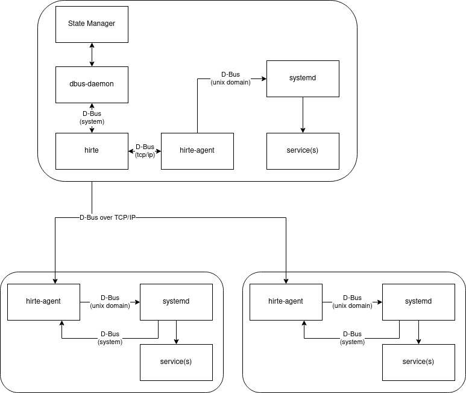

# Hirte

## What is hirte?

Hirte is a deterministic multi-node service manager

Hirte can manage the states of different services across multiple nodes with a
focus on highly regulated industries, such as those requiring function safety.
Hirte integrates with systemd via its D-Bus API and relays D-Bus messages over
TCP for multi-nodes support.

On the main node a service called `hirte` is running. On startup, the manager
loads the configuration files which describe all the involved systems
(called nodes) that are expected to be managed. Each node has a
unique name that is used to reference it in the manager.

On each managed node that is under control of Hirte a service called `hirte-agent`
is running. When the service starts, it connects (via D-Bus over TCP) to the manager
and registers as available (optionally authenticating). It then receives requests
from the manager and reports local state changes to it.

## Background

Hirte is built around three components:

* hirte service, running on the primary node, is the primary orchestrator
* hirte-agent services, with one running on each managed node, is the agent
  talking locally to systemd to act on services
* hirtectl command line program, is meant to be used by administrators to test,
  debug, or manually manage services across nodes.

Hirte is meant to be used in conjunction with a state manager (a program or
person) knowing the desired state of the system(s). This design choice has a few
consequences: a) hirte itself does not know the desired final state of the
system(s), it only knows how to transition between states, i.e.: how to start,
stop, restart a service on one or more nodes. b) hirte monitors and reports
changes in services running, so that the state manager is notified when a
service stops running or when the connection to a node is lost, but hirte itself
does not act on these notifications. c) hirte does not handle the “initial
setup” of the system, it is assumed that the system boots in a desired state and
hirte handles the transitions from this state.

The state manager program integrates with hirte over D-Bus. The state manager
asks hirte to perform actions or to receive the outcome of actions. Hirte
reports state changes back to the state manager when monitoring services and
nodes via D-Bus. For administrators, hirtectl is the preferred interface sparing
administrators from interacting with hirte via D-Bus directly.

## Overview

Here is a generic overview of the hirte architecture:

